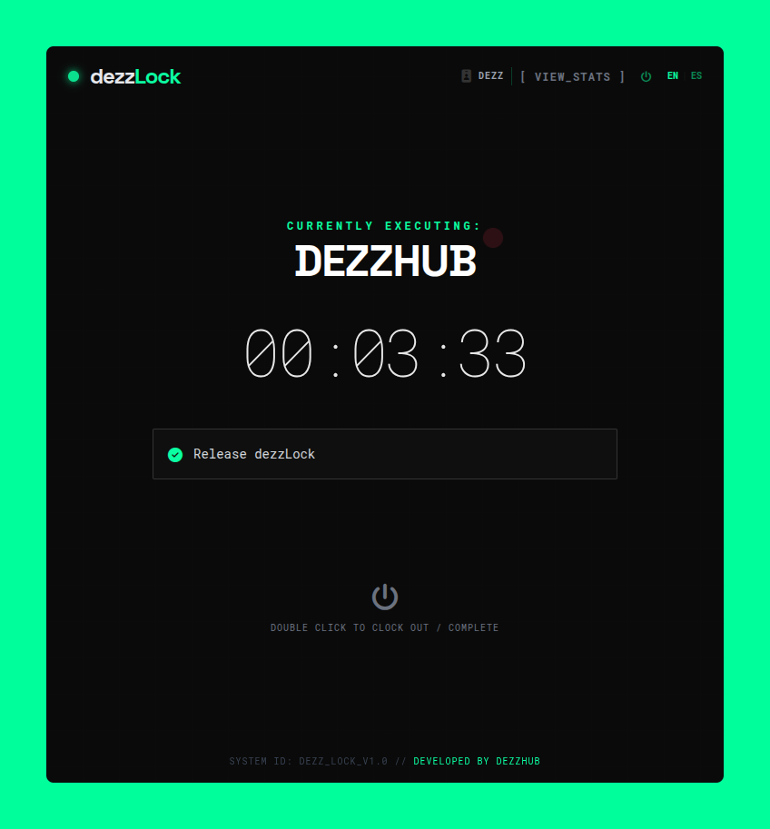
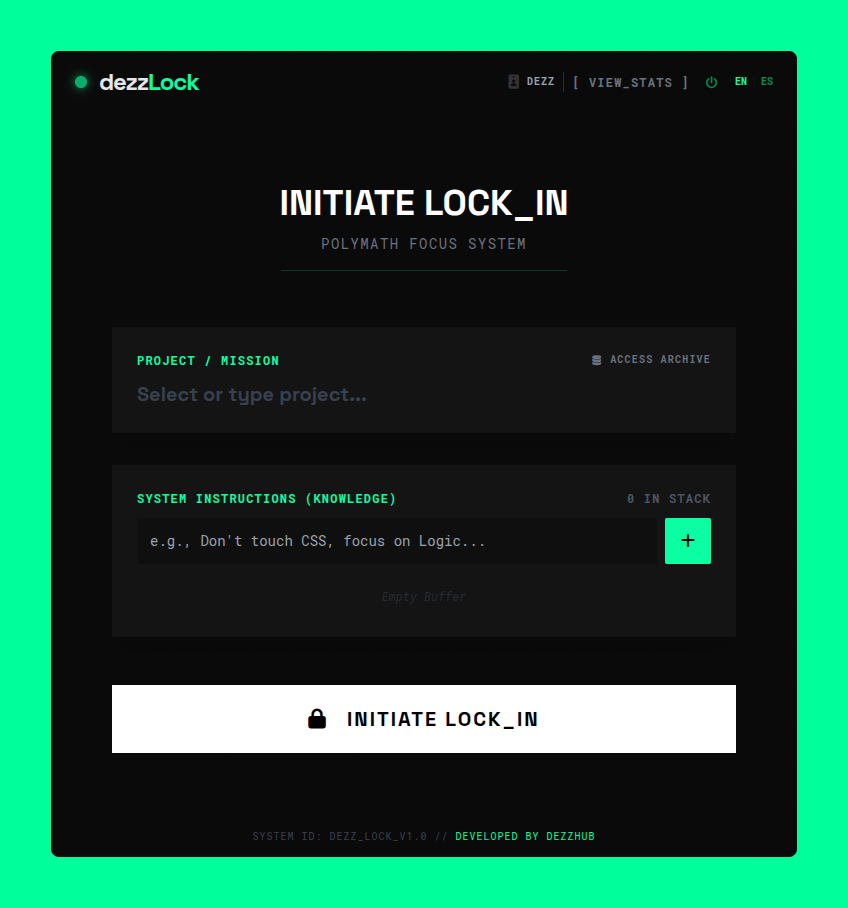
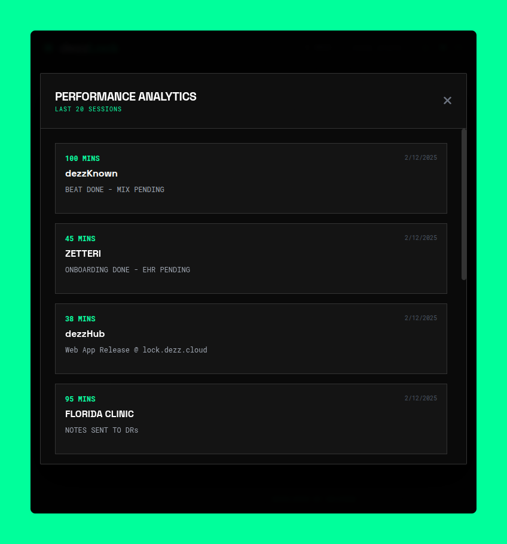

<div align="right">
  <a href="./README.md">
    
  </a>
</div>

<div align="center">

  # dezzLock 🔒
  ### THE POLYMATH FOCUS SYSTEM

  <!-- BADGES MEJORADOS CON CONTRASTE -->
  
  
  

  <p align="center">
    A native "State Manager" for the creative brain. Stop deciding, start executing.
    <br />
    <br />
    <a href="https://lock.dezz.cloud"><strong>Launch Web App »</strong></a>
    ·
    <a href="https://github.com/josefagundezz/dezzLock/releases"><strong>Download Desktop App »</strong></a>
  </p>
</div>

---

## ⚡ System Overview

**dezzLock** isn't just a timer; it's a **psychological anchor**. Designed for polymaths, developers, and creatives who juggle multiple projects simultaneously.

Traditional "To-Do" lists create anxiety. **dezzLock** forces a state of flow by simulating a "Clock-In" mechanism, locking the interface to a single task, and maintaining a persistent knowledge base of your active missions.

### "Externalize your working memory."

---

## 📸 Interface Data

<div align="center">
  
  <br>
  <em>The Lock-In HUD: Distraction-free focus environment.</em>
</div>

<br>

<div align="center">
  <div style="display: flex; justify-content: center; gap: 20px;">
    
    
  </div>
  <em>Performance Analytics & Knowledge Archive.</em>
</div>

---

## 🧩 Core Modules

### 🧠 The Knowledge Brain (Database)
Instead of typing tasks repeatedly, save them to your personal **Cloud Brain**.
- **Recall Protocol:** Instantly load projects from the dropdown or the Brain Archive.
- **Persistence:** New projects are auto-saved to Supabase.
- **Status Tracking:** Mark projects as `PENDING` or `DONE`.

### 🔒 The Lock-In Mechanism
- **Distraction-Free HUD:** Once locked, the UI simplifies to show only Time, Project, and Instructions.
- **Double-Confirm:** To clock out, you must interact deliberately (Double Click), preventing accidental breaks.
- **Visual Feedback:** Uses distinct Dark Mode aesthetics with Neon accents (`#00ff9b`) to trigger the "Work Mode" mindset.

### 📊 Performance Analytics
- **Session Archive:** Tracks every second of focus.
- **Smart Logs:** Before clocking out, the system requests a summary of what was accomplished (e.g., "Commits pushed", "Bug fixed").
- **Dashboard:** Visualize your last 20 sessions and total flow time directly in the app.

### 🛡️ Authentication & Security
- **Secure Access:** Powered by **Supabase Auth**.
- **Magic Links & Recovery:** Built-in password reset and email handling.
- **Data Privacy:** Your tasks are secured via Row Level Security (RLS).

---

## 🛠️ Tech Stack (The Engine)

Built with resilience and performance in mind.

| Component | Technology | Description |
| :--- | :--- | :--- |
| **Frontend** | React + Vite | Blazing fast UI rendering. |
| **Styling** | TailwindCSS | Cyberpunk aesthetic system. |
| **Backend** | Supabase | Postgres Database & Auth handling. |
| **Desktop Wrapper** | Electron | Native execution on Linux & Windows. |
| **Builder** | Electron-Builder | Compiled to `.AppImage` and `.exe`. |

---

## 🚀 Installation & Usage

### Web Version
Access instantly via any browser: [**lock.dezz.cloud**](https://lock.dezz.cloud)

### Desktop Native (Recommended)
Get the distraction-free experience.

**Windows (.exe)**
1. Go to [Releases](https://github.com/josefagundezz/dezzLock/releases).
2. Download `dezzLock Setup 1.0.0.exe`.
3. Install and Lock In.

**Linux (.AppImage)**
1. Download `dezzLock-1.0.0.AppImage`.
2. Right click -> Properties -> Allow executing file as program.
3. Run.

---

## 👨‍💻 Developer Build

To clone and run this system locally:

```bash
# 1. Clone the repository
git clone https://github.com/josefagundezz/dezzLock.git

# 2. Enter the matrix
cd dezzLock

# 3. Install dependencies
npm install

# 4. Run development mode (Web)
npm run dev

# 5. Build Desktop App (Outputs to /release folder)
npm run electron:build
```

<div align="center">
<br/>
<p>DESIGNED & ENGINEERED BY</p>
<h2>dezzHub</h2>
<p><em>Minds are for having ideas, not holding them.</em></p>
</div>
